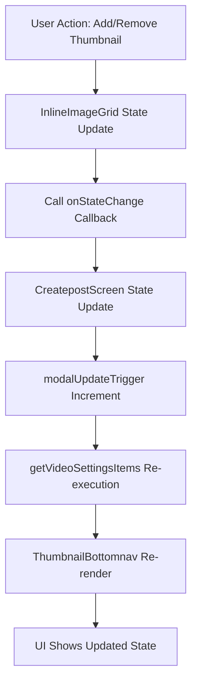

# Design Document

## Overview

This design addresses the thumbnail UI synchronization issue where changes to thumbnail state (add/remove) don't immediately reflect in the ThumbnailBottomnav modal. The problem occurs because the modal doesn't re-render when the underlying state changes, requiring users to close and reopen the modal to see updates.

## Architecture

### Root Cause Analysis
The issue stems from the fact that the ThumbnailBottomnav modal receives its items array as props from CreatepostScreen's `getVideoSettingsItems()` function, but this function is only called when the modal is initially opened, not when the underlying state changes.

### State Flow Problem
1. User opens video settings modal → `getVideoSettingsItems()` called → items array generated
2. User adds/removes thumbnail → state updates in InlineImageGrid component
3. Modal continues to show old items array → UI appears stale
4. User closes and reopens modal → `getVideoSettingsItems()` called again → fresh items array

### Solution Architecture
The solution involves implementing a reactive state update mechanism that ensures the modal re-renders whenever the underlying thumbnail state changes.

## Components and Interfaces

### Enhanced State Management

#### Modified InlineImageGrid Component
The InlineImageGrid component needs to communicate state changes back to the parent CreatepostScreen component in real-time.

```javascript
// Enhanced callback mechanism
const handleVideoSettingsOpen = (data) => {
  setVideoSettingsData({
    ...data,
    // Add reactive update mechanism
    onStateChange: (newState) => {
      // Force re-render of modal items
      setVideoSettingsData(prev => ({
        ...prev,
        ...newState,
        lastUpdate: Date.now() // Force re-render trigger
      }));
    }
  });
  setShowVideoSettings(true);
};
```

#### Updated CreatepostScreen State Management
```javascript
// Add state change listener
const [modalUpdateTrigger, setModalUpdateTrigger] = useState(0);

// Enhanced getVideoSettingsItems with reactive updates
const getVideoSettingsItems = useCallback(() => {
  if (!videoSettingsData) return [];
  
  // Function will re-run when modalUpdateTrigger changes
  const currentThumbnail = videoSettingsData.currentVideoIndex !== null
    ? videoSettingsData.videoSettings.thumbnails[videoSettingsData.currentVideoIndex]
    : null;

  // ... rest of items generation logic
}, [videoSettingsData, modalUpdateTrigger]);
```

### Real-time Update Mechanism

#### State Change Propagation
```javascript
// In InlineImageGrid - thumbnail upload handler
const handleThumbnailUpload = (videoIndex = currentVideoIndex) => {
  // ... existing upload logic
  
  setVideoSettings(prev => {
    const newSettings = {
      ...prev,
      thumbnails: {
        ...prev.thumbnails,
        [videoIndex]: thumbnail,
      },
    };
    
    // Notify parent of state change
    if (onVideoSettingsOpen && videoSettingsData?.onStateChange) {
      videoSettingsData.onStateChange({
        videoSettings: newSettings,
        lastUpdate: Date.now()
      });
    }
    
    return newSettings;
  });
};

// In InlineImageGrid - thumbnail removal handler
const handleThumbnailRemoval = (videoIndex) => {
  setVideoSettings(prev => {
    const newThumbnails = {...prev.thumbnails};
    delete newThumbnails[videoIndex];
    
    const newSettings = {
      ...prev,
      thumbnails: newThumbnails,
    };
    
    // Notify parent of state change
    if (videoSettingsData?.onStateChange) {
      videoSettingsData.onStateChange({
        videoSettings: newSettings,
        lastUpdate: Date.now()
      });
    }
    
    return newSettings;
  });
};
```

### Modal Re-rendering Strategy

#### Force Update Mechanism
```javascript
// In CreatepostScreen
useEffect(() => {
  if (videoSettingsData?.lastUpdate) {
    // Force modal to regenerate items when state changes
    setModalUpdateTrigger(prev => prev + 1);
  }
}, [videoSettingsData?.lastUpdate]);

// Enhanced ThumbnailBottomnav usage
<ThumbnailBottomnav
  visible={showVideoSettings}
  onClose={() => {
    setShowVideoSettings(false);
    if (videoSettingsData?.setShowVideoSettings) {
      videoSettingsData.setShowVideoSettings(false);
    }
  }}
  title="Video Settings"
  items={getVideoSettingsItems()} // Will re-run when modalUpdateTrigger changes
  height={calculateModalHeight()}
  key={modalUpdateTrigger} // Force component re-mount on state changes
/>
```

## Data Models

### Enhanced VideoSettingsData Interface
```javascript
interface VideoSettingsData {
  videoIndex: number;
  videoSettings: {
    autoPlay: boolean;
    thumbnails: Record<number, ThumbnailData>;
  };
  setVideoSettings: (updater: Function) => void;
  currentVideoIndex: number;
  setCurrentVideoIndex: (index: number) => void;
  setShowVideoSettings: (show: boolean) => void;
  onStateChange?: (newState: Partial<VideoSettingsData>) => void; // New
  lastUpdate?: number; // New - timestamp for change tracking
}

interface ThumbnailData {
  uri: string;
  fileName: string;
  fileSize: number;
  width?: number;
  height?: number;
}
```

### State Synchronization Flow


## Error Handling

### State Synchronization Errors
- Handle cases where callback functions are undefined
- Implement fallback mechanisms for failed state updates
- Add error boundaries to prevent UI crashes during state transitions

### Performance Considerations
- Debounce rapid state changes to prevent excessive re-renders
- Use React.memo and useCallback to optimize component performance
- Implement cleanup mechanisms to prevent memory leaks

## Testing Strategy

### Unit Tests
1. **State Synchronization**
   - Test callback mechanism triggers correctly
   - Verify state updates propagate to parent component
   - Test edge cases with rapid state changes

2. **Modal Re-rendering**
   - Test modal updates when thumbnail added
   - Test modal updates when thumbnail removed
   - Verify modal height adjusts correctly

### Integration Tests
1. **End-to-End Workflow**
   - Upload thumbnail → verify immediate UI update
   - Remove thumbnail → verify immediate UI update
   - Multiple rapid changes → verify UI stability

2. **Performance Tests**
   - Test with multiple videos and thumbnails
   - Verify no memory leaks during state updates
   - Test modal responsiveness under load

## Implementation Notes

### React Hooks Usage
- Use `useCallback` for memoizing functions that depend on state
- Use `useEffect` for handling state change side effects
- Use `useState` with functional updates for complex state objects

### Performance Optimizations
- Implement debouncing for rapid state changes
- Use React.memo for expensive component re-renders
- Optimize image loading and caching strategies

### Backward Compatibility
- Ensure existing functionality remains intact
- Maintain current API contracts with parent components
- Add new features as optional enhancements